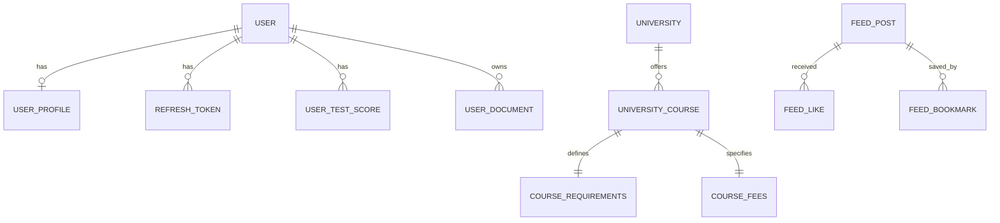

# Database Schema Design

EA Overseas uses **PostgreSQL 16** with **Prisma ORM**. The schema is designed for 360-degree student educational tracking and discovery.

## Core Models

### Auth & Users
- `User`: Central account record.
- `RefreshToken`: Session management and security.

### Profile Builder
- `UserProfile`: Core student data (Basic, Academics, Goals).
- `UserTestScore`: Relational table for exams like IELTS/SAT.
- `UserDocument`: Meta-data for files stored in R2.

### College Discovery
- `University`: Institutional profiles.
- `UniversityCourse`: Program-level data (Fees, Requirements).
- `CourseRequirements`: Specific entry criteria for each program.
- `CourseFees`: Tuition and living cost breakdown.

### Global Feed
- `FeedPost`: Admin-curated education updates.
- `FeedLike` / `FeedBookmark`: User engagement tracking.

## Phase 1 ERD (simplified)

## Naming Conventions
- **Tables**: CamelCase models in Prisma mapping to snake_case in Postgres.
- **Fields**: snake_case for all column names.
- **IDs**: UUIDs (v4) for all primary keys.
- **Soft Deletes**: `deleted_at` timestamp used instead of hard deletes where data retention is needed.
- **Audit**: `created_at` and `updated_at` on every table.
