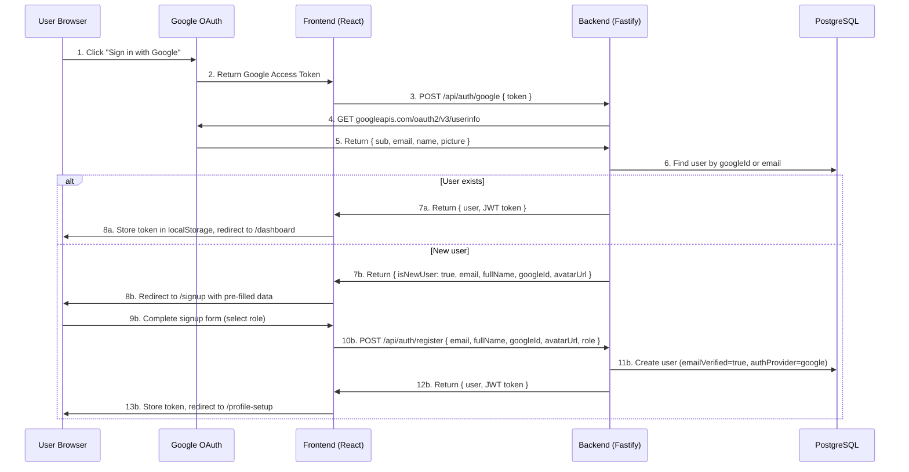
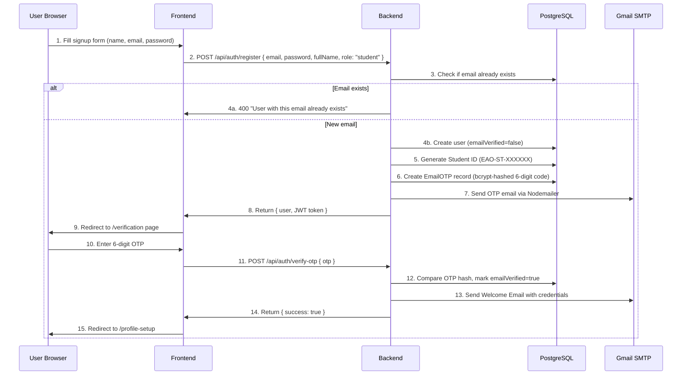
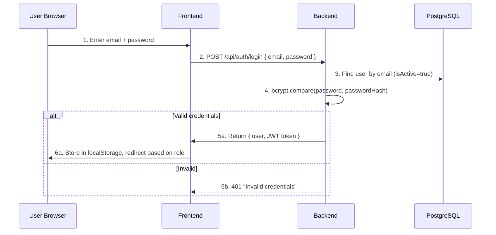

# 06 — Authentication Flow

This document traces every step of the login/registration process from the moment a user clicks "Sign In" to when they see their dashboard.

---

## Flow 1: Google OAuth Login (Primary Method)

### Key Details:
- The frontend uses `@react-oauth/google` with an **implicit flow** (gets access token, not ID token)
- The backend verifies the token by calling Google's userinfo endpoint directly
- Google-authenticated users skip OTP verification (`emailVerified` is set to `true` immediately)
- If the email already exists in the DB but without a `googleId`, the backend **links** the Google account to the existing user

---

## Flow 2: Email/Password Registration

### Key Details:
- Only `student` role is allowed for public registration; other roles require admin creation
- OTPs expire after **15 minutes** and allow **max 5 attempts**
- The OTP is hashed with bcrypt before storage (never stored in plaintext)
- Users can request a new OTP via `/api/auth/resend-otp` (invalidates all previous OTPs)

---

## Flow 3: Email/Password Login

---

## Token Storage (Frontend)

| Key | Value | Purpose |
|---|---|---|
| `eaoverseas_token` | JWT string | Sent as `Authorization: Bearer <token>` header |
| `eaoverseas_user` | JSON string | Cached user object (name, email, role, id) |

---

## Role-Based Redirect After Login

The `Login.tsx` page checks the user's role and redirects accordingly:

| Role | Redirects To |
|---|---|
| `super_admin` | `/Superadmin` |
| `admin` | `/Superadmin` |
| `counsellor` | `/counsellor-dashboard` |
| `student` | `/dashboard` |

---

## Protected Route Guard

The `ProtectedRoute` component:
1. Checks if `user` exists in `AuthContext`
2. If no user → shows `LoginModal`
3. If `allowedRoles` prop is set → also checks if `user.role` is in the allowed list
4. If role not allowed → redirects to `/dashboard`
